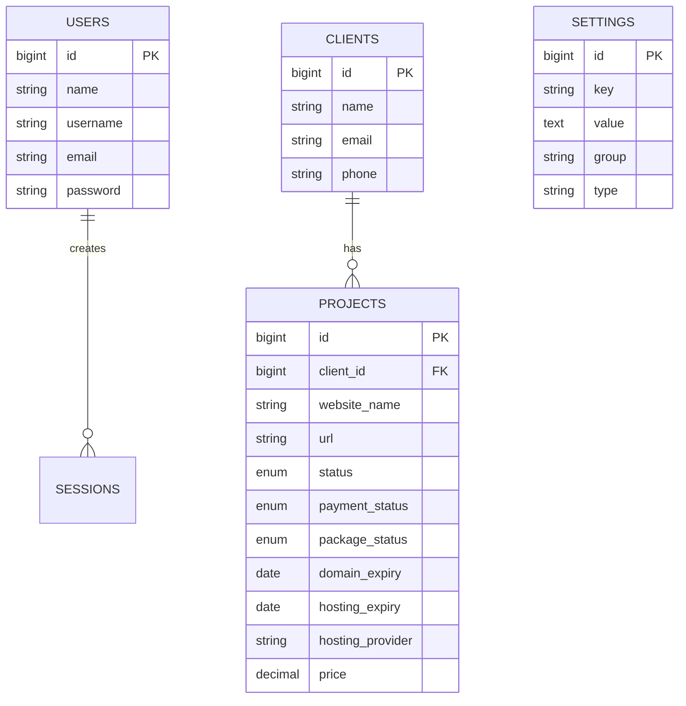

<div align="center">

# 📊 Dashboard Proyek — Manajemen Client & Proyek

Kelola client dan proyek website dengan nyaman: status pekerjaan, paket layanan, pembayaran, serta pengingat kadaluarsa domain/hosting.

<br/>


<br/>

[](https://laravel.com)
[](https://www.php.net/)
[](https://nodejs.org/)
[](https://tailwindcss.com/)
[](#lisensi)

</div>

> Dibangun dengan: Laravel 12, Tailwind CSS 4, Vite, Alpine.js

## 📌 Daftar Isi

- [✨ Fitur Utama](#-fitur-utama)
- [🧩 Teknologi](#-teknologi)
- [✅ Persyaratan](#-persyaratan)
- [⚙️ Instalasi & Menjalankan](#️-instalasi--menjalankan)
- [🔑 Akun Awal (Seeder)](#-akun-awal-seeder)
- [🧭 Alur Aplikasi](#-alur-aplikasi)
- [🗃️ Skema Data (Ringkas)](#️-skema-data-ringkas)
- [📁 Struktur Proyek](#-struktur-proyek)
- [🧪 Testing](#-testing)
- [🛠️ Troubleshooting](#️-troubleshooting)
- [🖼️ Screenshots](#️-screenshots)
- [🔗 API Examples (AJAX)](#-api-examples-ajax)
- [📜 Lisensi](#-lisensi)

## ✨ Fitur Utama

- Autentikasi: login via email atau username, logout, proteksi halaman dengan middleware `auth`.
- Dashboard: ringkasan metrik (total client/proyek), jumlah domain/hosting yang segera kadaluarsa, daftar terbaru client/proyek, kalender aktivitas per bulan, dan grafik jumlah proyek per periode.
- Manajemen Client: daftar, cari, tambah, edit, hapus; relasi 1..N dengan proyek dan hitung jumlah proyek per client.
- Manajemen Proyek: daftar, cari, tambah, edit, hapus; field lengkap termasuk `status`, `payment_status`, `package_status`, `domain_expiry`, `hosting_expiry`, `hosting_provider`, `price`, dan `notes`.
- Filter & Pencarian: filter di Dashboard dan Projects berdasarkan nama client, status pembayaran/paket, status kadaluarsa, serta pencarian global.
- Settings: halaman pengaturan profil user (nama, username, email, ganti password).
- Theming: variabel warna dan favicon dapat diambil dari tabel `settings` (opsional) untuk menyesuaikan tampilan.

## 🧩 Teknologi

- Backend: Laravel 12 (PHP 8.2+), Eloquent ORM, Queue (driver database), Sessions (driver database).
- Frontend: Tailwind CSS 4, Vite, Alpine.js (CDN), Blade templates.
- Database: MySQL/MariaDB (default), dukungan SQLite untuk pengujian.

## ✅ Persyaratan

- PHP 8.2 atau lebih baru dengan ekstensi: `pdo_mysql`, `mbstring`, `openssl`, `tokenizer`, `xml`, `ctype`, `json`.
- Composer (untuk dependency PHP).
- Node.js 18+ dan NPM (untuk aset frontend via Vite).
- MySQL/MariaDB berjalan lokal.

## ⚙️ Instalasi & Menjalankan

1) Clone & dependency
- `composer install`
- `npm ci` (atau `npm install`)

2) Konfigurasi environment
- Salin `.env.example` menjadi `.env` lalu isi kredensial DB:
  - `DB_CONNECTION=mysql`
  - `DB_HOST=127.0.0.1` (atau `localhost` bila pakai socket)
  - `DB_PORT=3306`
  - `DB_DATABASE=dashboard_proyek`
  - `DB_USERNAME=...`
  - `DB_PASSWORD=...`
- Generate APP_KEY: `php artisan key:generate`

3) Database
- Buat database `dashboard_proyek` di MySQL.
- Jalankan migrasi & seeder: `php artisan migrate --seed`
- Buat symlink storage: `php artisan storage:link`

4) Aset Frontend
- Mode dev (Vite server): `npm run dev`
- Build produksi: `npm run build` (file akan dihasilkan ke `public/build`)

5) Menjalankan server
- Minimal: `php artisan serve` lalu buka `http://127.0.0.1:8000`
- Atau jalankan semua proses dev sekaligus: `composer dev`
  - Menjalankan: PHP server, queue listener, pail (log viewer), dan Vite dev server secara paralel.

## 🔑 Akun Awal (Seeder)

- Admin: email `admin@dashboard.com`, username `admin`, password `password`.

## 🧭 Alur Aplikasi

- Autentikasi
  - GET `/login` menampilkan form; POST `/login` menerima `login` (email/username) dan `password`.
  - Setelah login berhasil, diarahkan ke `/dashboard`. POST `/logout` untuk keluar.
- Dashboard (`/dashboard`)
  - Tampilkan metrik ringkas, daftar terbaru, kalender proyek per hari, dan grafik agregasi proyek (bulanan atau tahunan) dengan dukungan AJAX untuk pemuatan data grafik dan kalender.
  - Filter: `client_name`, `payment_status`, `package_status`, `expiry_status` (`expired|warning|safe`), dan `search` global.
- Clients (`/clients`)
  - CRUD client. Pencarian berdasarkan nama/email/telepon. Menampilkan hitungan proyek per client.
- Projects (`/projects`)
  - CRUD proyek. Field tervalidasi termasuk status enum berikut:
    - `status`: `planning|in_progress|completed|on_hold`
    - `payment_status`: `pending|paid|overdue`
    - `package_status`: `website|maintenance|seo|website_maintenance|website_seo|website_maintenance_seo`
  - Endpoint AJAX untuk mengambil detail proyek: `GET /projects/fetch/{project}`.
- Settings (`/settings`)
  - Update profil user (nama, username, email, password). Validasi unique dan `current_password` saat mengganti password.
- Theming
  - Layout membaca `$appSettings` (dibagikan via `AppServiceProvider`) sehingga variabel warna seperti `primary_color`, `secondary_color`, `accent_color`, serta `favicon` dapat dikonfigurasi via tabel `settings`.

## 🗃️ Skema Data (Ringkas)

- `users`: name, username (unik), email (unik), password, timestamps.
- `clients`: name, phone, email, address, notes, timestamps.
- `projects`: client_id (FK), website_name, url, status, notes, domain_expiry, hosting_expiry, hosting_provider, price, payment_date, payment_status, package_status, timestamps.
- `settings`: key (unik), value (text), type, group, label, description, is_public, timestamps.
- Tabel pendukung: `sessions`, `jobs`, `cache`, `migrations`.

Catatan migrasi penting:
- Beberapa migrasi melakukan transformasi enum (mis. `payment_status` dan `status`). Jalankan migrasi berurutan agar penyesuaian data berjalan aman.

### 🧰 Perintah Berguna

- Cache/config/view/route clear: 
  - `php artisan config:clear && php artisan cache:clear && php artisan route:clear && php artisan view:clear`
- Daftar rute: `php artisan route:list`
- Listener antrian (queue): `php artisan queue:listen --tries=1`

## 📁 Struktur Proyek

```
dashboard-proyek/
├─ app/
│  ├─ Http/
│  │  └─ Controllers/
│  │     ├─ AuthController.php
│  │     ├─ DashboardController.php
│  │     ├─ ClientController.php
│  │     ├─ ProjectController.php
│  │     └─ SettingController.php
│  ├─ Models/
│  │  ├─ User.php
│  │  ├─ Client.php
│  │  ├─ Project.php
│  │  └─ Setting.php
│  └─ Providers/
│     └─ AppServiceProvider.php
├─ bootstrap/
│  ├─ app.php
│  └─ providers.php
├─ config/
│  ├─ app.php, auth.php, cache.php, database.php, filesystems.php,
│  │  logging.php, mail.php, queue.php, session.php, services.php
├─ database/
│  ├─ migrations/
│  │  ├─ 0001_01_01_000000_create_users_table.php
│  │  ├─ 0001_01_01_000001_create_cache_table.php
│  │  ├─ 0001_01_01_000002_create_jobs_table.php
│  │  ├─ 2025_07_25_003626_create_clients_table.php
│  │  ├─ 2025_07_25_003638_create_projects_table.php
│  │  ├─ 2025_07_25_141517_update_payment_status_enum_in_projects_table.php
│  │  ├─ 2025_07_25_142032_add_package_status_to_projects_table.php
│  │  ├─ 2025_07_26_060920_add_username_to_users_table.php
│  │  ├─ 2025_07_26_081609_add_hosting_provider_to_projects_table.php
│  │  ├─ 2025_07_26_175233_update_status_enum_in_projects_table.php
│  │  └─ 2025_08_03_011047_create_settings_table.php
│  └─ seeders/
│     ├─ AdminUserSeeder.php
│     ├─ ClientSeeder.php
│     ├─ ProjectSeeder.php
│     ├─ SettingSeeder.php
│     └─ DatabaseSeeder.php
├─ public/
│  ├─ index.php
│  ├─ build/        # output Vite (CSS/JS produksi)
│  └─ storage -> storage/app/public
├─ resources/
│  ├─ views/
│  │  ├─ layouts/ (app.blade.php, guest.blade.php)
│  │  ├─ dashboard/
│  │  ├─ clients/
│  │  ├─ projects/
│  │  ├─ settings/
│  │  ├─ auth/login.blade.php
│  │  └─ custom/pagination.blade.php
│  ├─ css/app.css
│  └─ js/ (app.js, bootstrap.js)
├─ routes/
│  ├─ web.php
│  └─ console.php
├─ tests/
│  ├─ Feature/ExampleTest.php
│  ├─ Unit/ExampleTest.php
│  └─ TestCase.php
├─ artisan
├─ composer.json, composer.lock
├─ package.json, package-lock.json
├─ tailwind.config.js, postcss.config.js, vite.config.js
└─ README.md
```

Konvensi singkat
- Routes → `routes/web.php` terhubung ke controller di `app/Http/Controllers`.
- Model → `app/Models` mengelola relasi dan accessor (status expiry/label paket di `Project`).
- Views → `resources/views` menggunakan Blade + Tailwind, asset di-load via `@vite`.
- Settings global → dibagikan ke semua view melalui `AppServiceProvider` sebagai `$appSettings`.

## 🧪 Testing

- Menjalankan test: `composer test` (menggunakan PHPUnit).

## 🛠️ Troubleshooting

- Tidak bisa konek DB (SQLSTATE[HY000] [2002]):
  - Ganti `DB_HOST=localhost` atau isi `DB_SOCKET` sesuai `socket` MySQL Anda.
- Access denied (1045):
  - Pastikan user/password benar dan user memiliki privilege ke database (`GRANT ALL PRIVILEGES ON dashboard_proyek.* TO ...`).
- `vendor/autoload.php` tidak ditemukan:
  - Jalankan `composer install`.
- CSS/JS tidak muncul saat dev:
  - Jalankan `npm run dev` atau lakukan build `npm run build`.
- Permission storage/cache:
  - Pastikan `storage/` dan `bootstrap/cache/` writable (mis. `chmod -R 775 storage bootstrap/cache`).

## 🖼️ Screenshots

Letakkan gambar di `docs/screenshots/` dan sesuaikan nama file berikut bila berbeda.


## 🔗 API Examples (AJAX)

Contoh endpoint yang mengembalikan JSON untuk dipakai oleh UI.

1) Projects Fetch (detail proyek)

Request:

```
GET /projects/fetch/{project_id}
```

cURL:

```
curl -H "X-Requested-With: XMLHttpRequest" \
  http://localhost:8000/projects/fetch/1
```

Response (200 OK):

```json
{
  "success": true,
  "project": {
    "id": 1,
    "client_id": 1,
    "website_name": "Company Website",
    "url": "company-website.com",
    "status": "completed",
    "domain_expiry": "2026-07-25",
    "hosting_expiry": "2026-07-25",
    "hosting_provider": "Virtual Server",
    "price": "15000000.00",
    "payment_date": "2025-06-25",
    "payment_status": "paid",
    "package_status": "website_maintenance",
    "notes": "Website perusahaan...",
    "client": { "id": 1, "name": "PT. Technology Solutions" }
  }
}
```

2) Dashboard Chart Data

Request params:

```
GET /dashboard?ajax_chart=1&chart_year=2025&chart_period=month
```

Response (contoh):

```json
{
  "success": true,
  "chartData": [
    { "period": "Jan", "count": 2 },
    { "period": "Feb", "count": 5 }
  ]
}
```

3) Dashboard Calendar (proyek pada tanggal tertentu)

Request params:

```
GET /dashboard?calendar_date=15&calendar_year=2025&calendar_month=8
```

Response (contoh):

```json
{
  "success": true,
  "date": "15 Aug 2025",
  "projects": [
    {
      "id": 3,
      "name": "E-commerce Platform",
      "client_name": "Toko Online Sejahtera",
      "package_name": null,
      "package_status": "website_maintenance_seo",
      "status": "on_hold",
      "created_at": "2025-08-15T10:30:00.000000Z"
    }
  ]
}
```

## 📜 Lisensi

---

## 🗺️ Diagram ER (Mermaid)

> Diagram konseptual relasi antar tabel utama.



## 🎬 Demo (Opsional)

Tambahkan GIF demo ke `docs/screenshots/demo.gif`, lalu tampilkan di sini:

```markdown

```

Proyek ini menggunakan Laravel (MIT). Lisensi kode aplikasi mengikuti lisensi repo ini.
