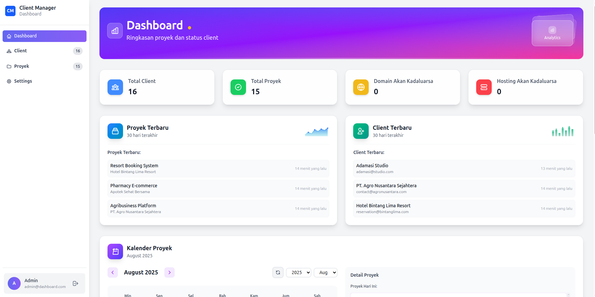

<div align="center">

# 📊 Dashboard Proyek — Manajemen Client & Proyek

Kelola client dan proyek website dengan nyaman: status pekerjaan, paket layanan, pembayaran, serta pengingat kadaluarsa domain/hosting.

[](https://laravel.com)
[](https://www.php.net/)
[](https://nodejs.org/)
[](https://tailwindcss.com/)
[](#lisensi)

</div>

> Dibangun dengan: Laravel 12, Tailwind CSS 4, Vite, Alpine.js

## 📌 Daftar Isi

- [✨ Fitur Utama](#✨-fitur-utama)
- [🧩 Teknologi](#🧩-teknologi)
- [✅ Persyaratan](#✅-persyaratan)
- [⚙️ Instalasi & Menjalankan](#⚙️-instalasi--menjalankan)
- [🔑 Akun Awal (Seeder)](#🔑-akun-awal-seeder)
- [🧭 Alur Aplikasi](#🧭-alur-aplikasi)
- [🧠 Hal Penting untuk Dipahami](#🧠-hal-penting-untuk-dipahami)
- [🗃️ Skema Data (Ringkas)](#🗃️-skema-data-ringkas)
- [📁 Struktur Proyek](#📁-struktur-proyek)
- [🧭 Quick Reference (URL → Controller → View)](#🧭-quick-reference-url--controller--view)
- [🔐 Environment Variables Penting](#🔐-environment-variables-penting)
- [🚀 Checklist Produksi (Penting)](#🚀-checklist-produksi-penting)
- [⚠️ Batasan & Catatan](#⚠️-batasan--catatan)
- [🚫 Jangan Dimasukkan ke Repo](#🚫-jangan-dimasukkan-ke-repo)
- [🖼️ Screenshots](#🖼️-screenshots)
- [🚧 Roadmap](#🚧-roadmap)
- [🤝 Contributing](#🤝-contributing)
- [📜 Lisensi](#📜-lisensi)

## ✨ Fitur Utama

- Autentikasi: login via email atau username, logout, proteksi halaman dengan middleware `auth`.
- Dashboard: ringkasan metrik (total client/proyek), jumlah domain/hosting yang segera kadaluarsa, daftar terbaru client/proyek, kalender aktivitas per bulan, dan grafik jumlah proyek per periode.
- Manajemen Client: daftar, cari, tambah, edit, hapus; relasi 1..N dengan proyek dan hitung jumlah proyek per client.
- Manajemen Proyek: daftar, cari, tambah, edit, hapus; field lengkap termasuk `status`, `payment_status`, `package_status`, `domain_expiry`, `hosting_expiry`, `hosting_provider`, `price`, dan `notes`.
- Filter & Pencarian: filter di Dashboard dan Projects berdasarkan nama client, status pembayaran/paket, status kadaluarsa, serta pencarian global.
- Settings: halaman pengaturan profil user (nama, username, email, ganti password).
- Theming: variabel warna dan favicon dapat diambil dari tabel `settings` (opsional) untuk menyesuaikan tampilan.

## 🧩 Teknologi

- Backend: Laravel 12 (PHP 8.2+), Eloquent ORM, Queue (driver database), Sessions (driver database).
- Frontend: Tailwind CSS 4, Vite, Alpine.js (CDN), Blade templates.
- Database: MySQL/MariaDB (default), dukungan SQLite untuk pengujian.

## ✅ Persyaratan

- PHP 8.2 atau lebih baru dengan ekstensi: `pdo_mysql`, `mbstring`, `openssl`, `tokenizer`, `xml`, `ctype`, `json`.
- Composer (untuk dependency PHP).
- Node.js 18+ dan NPM (untuk aset frontend via Vite).
- MySQL/MariaDB berjalan lokal.

## ⚙️ Instalasi & Menjalankan

1) Clone & dependency
- `composer install`
- `npm ci` (atau `npm install`)

2) Konfigurasi environment
- Salin `.env.example` menjadi `.env` lalu isi kredensial DB:
  - `DB_CONNECTION=mysql`
  - `DB_HOST=127.0.0.1` (atau `localhost` bila pakai socket)
  - `DB_PORT=3306`
  - `DB_DATABASE=dashboard_proyek`
  - `DB_USERNAME=...`
  - `DB_PASSWORD=...`
- Generate APP_KEY: `php artisan key:generate`

3) Database
- Buat database `dashboard_proyek` di MySQL.
- Jalankan migrasi & seeder: `php artisan migrate --seed`
- Buat symlink storage: `php artisan storage:link`

4) Aset Frontend
- Mode dev (Vite server): `npm run dev`
- Build produksi: `npm run build` (file akan dihasilkan ke `public/build`)

5) Menjalankan server
- Minimal: `php artisan serve` lalu buka `http://127.0.0.1:8000`
- Atau jalankan semua proses dev sekaligus: `composer dev`
  - Menjalankan: PHP server, queue listener, pail (log viewer), dan Vite dev server secara paralel.

## 🔑 Akun Awal (Seeder)

- Admin: email `admin@dashboard.com`, username `admin`, password `password`.

## 🧭 Alur Aplikasi

- Autentikasi
  - GET `/login` menampilkan form; POST `/login` menerima `login` (email/username) dan `password`.
  - Setelah login berhasil, diarahkan ke `/dashboard`. POST `/logout` untuk keluar.
- Dashboard (`/dashboard`)
  - Tampilkan metrik ringkas, daftar terbaru, kalender proyek per hari, dan grafik agregasi proyek (bulanan atau tahunan) dengan dukungan AJAX untuk pemuatan data grafik dan kalender.
  - Filter: `client_name`, `payment_status`, `package_status`, `expiry_status` (`expired|warning|safe`), dan `search` global.
- Clients (`/clients`)
  - CRUD client. Pencarian berdasarkan nama/email/telepon. Menampilkan hitungan proyek per client.
- Projects (`/projects`)
  - CRUD proyek. Field tervalidasi termasuk status enum berikut:
    - `status`: `planning|in_progress|completed|on_hold`
    - `payment_status`: `pending|paid|overdue`
    - `package_status`: `website|maintenance|seo|website_maintenance|website_seo|website_maintenance_seo`
  - Endpoint AJAX untuk mengambil detail proyek: `GET /projects/fetch/{project}`.
- Settings (`/settings`)
  - Update profil user (nama, username, email, password). Validasi unique dan `current_password` saat mengganti password.
- Theming
  - Layout membaca `$appSettings` (dibagikan via `AppServiceProvider`) sehingga variabel warna seperti `primary_color`, `secondary_color`, `accent_color`, serta `favicon` dapat dikonfigurasi via tabel `settings`.

## 🧠 Hal Penting untuk Dipahami

- Mode Login: menggunakan session auth Laravel; semua halaman utama dilindungi middleware `auth`.
- Peran (Roles): saat ini single role (Admin). Pengelolaan user multi-role belum tersedia.
- Data Seeder: membuat akun admin + data contoh client/proyek agar UI langsung terisi. Ubah/disable seeder sesuai kebutuhan produksi.
- Enums Penting:
  - `projects.status`: `planning|in_progress|completed|on_hold`
  - `projects.payment_status`: `pending|paid|overdue`
  - `projects.package_status`: `website|maintenance|seo|website_maintenance|website_seo|website_maintenance_seo`
- Pengingat Kadaluarsa: status `expired|warning|safe` diturunkan dari `domain_expiry`/`hosting_expiry` (lihat accessor di `App\Models\Project`).
- AJAX: beberapa elemen dashboard dan modal proyek memuat data via request AJAX (respons JSON), tetapi tetap memakai session (bukan token API).

## 🗃️ Skema Data (Ringkas)

- `users`: name, username (unik), email (unik), password, timestamps.
- `clients`: name, phone, email, address, notes, timestamps.
- `projects`: client_id (FK), website_name, url, status, notes, domain_expiry, hosting_expiry, hosting_provider, price, payment_date, payment_status, package_status, timestamps.
- `settings`: key (unik), value (text), type, group, label, description, is_public, timestamps.
- Tabel pendukung: `sessions`, `jobs`, `cache`, `migrations`.

Catatan migrasi penting:
- Beberapa migrasi melakukan transformasi enum (mis. `payment_status` dan `status`). Jalankan migrasi berurutan agar penyesuaian data berjalan aman.

### 🧰 Perintah Berguna

- Cache/config/view/route clear: 
  - `php artisan config:clear && php artisan cache:clear && php artisan route:clear && php artisan view:clear`
- Daftar rute: `php artisan route:list`
- Listener antrian (queue): `php artisan queue:listen --tries=1`

## 📁 Struktur Proyek

```
dashboard-proyek/
├─ app/
│  ├─ Http/
│  │  └─ Controllers/
│  │     ├─ AuthController.php
│  │     ├─ DashboardController.php
│  │     ├─ ClientController.php
│  │     ├─ ProjectController.php
│  │     └─ SettingController.php
│  ├─ Models/
│  │  ├─ User.php
│  │  ├─ Client.php
│  │  ├─ Project.php
│  │  └─ Setting.php
│  └─ Providers/
│     └─ AppServiceProvider.php
├─ bootstrap/
│  ├─ app.php
│  └─ providers.php
├─ config/
│  ├─ app.php, auth.php, cache.php, database.php, filesystems.php,
│  │  logging.php, mail.php, queue.php, session.php, services.php
├─ database/
│  ├─ migrations/
│  │  ├─ 0001_01_01_000000_create_users_table.php
│  │  ├─ 0001_01_01_000001_create_cache_table.php
│  │  ├─ 0001_01_01_000002_create_jobs_table.php
│  │  ├─ 2025_07_25_003626_create_clients_table.php
│  │  ├─ 2025_07_25_003638_create_projects_table.php
│  │  ├─ 2025_07_25_141517_update_payment_status_enum_in_projects_table.php
│  │  ├─ 2025_07_25_142032_add_package_status_to_projects_table.php
│  │  ├─ 2025_07_26_060920_add_username_to_users_table.php
│  │  ├─ 2025_07_26_081609_add_hosting_provider_to_projects_table.php
│  │  ├─ 2025_07_26_175233_update_status_enum_in_projects_table.php
│  │  └─ 2025_08_03_011047_create_settings_table.php
│  └─ seeders/
│     ├─ AdminUserSeeder.php
│     ├─ ClientSeeder.php
│     ├─ ProjectSeeder.php
│     ├─ SettingSeeder.php
│     └─ DatabaseSeeder.php
├─ public/
│  ├─ index.php
│  ├─ build/        # output Vite (CSS/JS produksi)
│  └─ storage -> storage/app/public
├─ resources/
│  ├─ views/
│  │  ├─ layouts/ (app.blade.php, guest.blade.php)
│  │  ├─ dashboard/
│  │  ├─ clients/
│  │  ├─ projects/
│  │  ├─ settings/
│  │  ├─ auth/login.blade.php
│  │  └─ custom/pagination.blade.php
│  ├─ css/app.css
│  └─ js/ (app.js, bootstrap.js)
├─ routes/
│  ├─ web.php
│  └─ console.php
├─ tests/
│  ├─ Feature/ExampleTest.php
│  ├─ Unit/ExampleTest.php
│  └─ TestCase.php
├─ artisan
├─ composer.json, composer.lock
├─ package.json, package-lock.json
├─ tailwind.config.js, postcss.config.js, vite.config.js
└─ README.md
```

Konvensi singkat
- Routes → `routes/web.php` terhubung ke controller di `app/Http/Controllers`.
- Model → `app/Models` mengelola relasi dan accessor (status expiry/label paket di `Project`).
- Views → `resources/views` menggunakan Blade + Tailwind, asset di-load via `@vite`.
- Settings global → dibagikan ke semua view melalui `AppServiceProvider` sebagai `$appSettings`.

## 🧭 Quick Reference (URL → Controller → View)

```
GET   /                 → redirect('/login')
GET   /login            → AuthController@showLogin   → resources/views/auth/login.blade.php
POST  /login            → AuthController@login
POST  /logout           → AuthController@logout

GET   /dashboard        → DashboardController@index  → resources/views/dashboard/index.blade.php

GET   /clients          → ClientController@index     → resources/views/clients/index.blade.php
POST  /clients          → ClientController@store
GET   /clients/{id}     → ClientController@show      → resources/views/clients/show.blade.php
GET   /clients/{id}/edit→ ClientController@edit      → resources/views/clients/edit.blade.php
PUT   /clients/{id}     → ClientController@update
DELETE/clients/{id}     → ClientController@destroy

GET   /projects                 → ProjectController@index → resources/views/projects/index.blade.php
GET   /projects/create          → ProjectController@create→ resources/views/projects/create.blade.php
POST  /projects                 → ProjectController@store
GET   /projects/{id}            → ProjectController@show  → resources/views/projects/show.blade.php
GET   /projects/{id}/edit       → ProjectController@edit  → resources/views/projects/edit.blade.php
PUT   /projects/{id}            → ProjectController@update
DELETE/projects/{id}            → ProjectController@destroy
GET   /projects/fetch/{id}      → ProjectController@fetch (AJAX JSON)

GET   /settings          → SettingController@index   → resources/views/settings/index.blade.php
POST  /settings/general  → SettingController@updateGeneral

GET   /test-color        → view('test-color')        → resources/views/test-color.blade.php
GET   /test-alpine       → view('test-alpine')       → resources/views/test-alpine.blade.php
```

## 🔐 Environment Variables Penting

- `APP_ENV`, `APP_DEBUG`, `APP_URL`: set sesuai lingkungan (dev/prod) dan domain.
- `DB_CONNECTION=mysql`, `DB_HOST`, `DB_PORT`, `DB_DATABASE`, `DB_USERNAME`, `DB_PASSWORD`.
- `SESSION_DRIVER=database`, `QUEUE_CONNECTION=database` (default proyek).
- `LOG_CHANNEL=stack`, `LOG_LEVEL=info|debug`.
- `MAIL_MAILER` (default log), set SMTP untuk produksi.

Jangan commit file `.env`. Gunakan `.env.example` sebagai referensi.

## 🚧 Roadmap

- RBAC (roles/permissions) untuk multi-user.
- Notifikasi email/WhatsApp untuk pengingat `domain_expiry`/`hosting_expiry`.
- Export/Import data (CSV/Excel) untuk clients dan projects.
- Lampiran/berkas proyek (upload file) per project.
- Filter lanjutan + saved filters dan kolom kustom.
- Peningkatan test coverage (Feature + Unit) dan CI pipeline.
- Docker dev environment + opsi Sail.
- I18n: dukungan multi-bahasa (ID/EN).

## 🤝 Contributing

- Fork repo dan buat branch fitur: `feat/nama-fitur` atau `fix/issue-xyz`.
- Ikuti gaya kode PSR-12 dan jalankan `php artisan pint` (bila tersedia) untuk formatting.
- Jalankan test lokal: `composer test`.
- Buat PR dengan deskripsi jelas, sertakan langkah uji dan screenshot bila relevan.

## 🚀 Checklist Produksi (Penting)

- Ganti kredensial admin bawaan (seeder): ubah email/username/password admin.
- Set: `APP_ENV=production`, `APP_DEBUG=false`, `APP_URL=https://domain-anda`.
- Database: jalankan `php artisan migrate` (tanpa seeder bila tidak perlu data contoh).
- Assets: `npm run build` (pastikan `public/build` ter-deploy).
- Cache optimisasi: `php artisan config:cache && php artisan route:cache && php artisan view:cache`.
- Queue worker: jalankan listener (jika diperlukan): `php artisan queue:listen` atau via supervisor.
- Storage symlink: `php artisan storage:link`.
- Permission: `storage/` dan `bootstrap/cache/` writable oleh PHP-FPM/web server.

## ⚠️ Batasan & Catatan

- Migrations enum: beberapa migrasi mengubah kolom `ENUM` via `DB::statement` (MySQL/MariaDB). Pastikan kompatibel dengan versi server Anda.
- Roles/permissions: belum ada RBAC. Semua pengguna saat ini setara (Admin).
- Email: default `MAIL_MAILER=log` (hanya log). Konfigurasikan SMTP untuk pengiriman email nyata.
- Tests: saat ini masih minimal (example tests). Perlu perluasan untuk cakupan fitur.

## 🚫 Jangan Dimasukkan ke Repo

- `.env` dan file kredensial lain (gunakan secrets di CI/CD).
- `storage/logs/*`, `storage/framework/*` (sudah di-`.gitignore`).
- `vendor/` dan `node_modules/` (gunakan `composer install` dan `npm ci`).

## 🖼️ Screenshots

Letakkan gambar di `docs/screenshots/` dan sesuaikan nama file berikut bila berbeda.





## 📜 Lisensi

---
